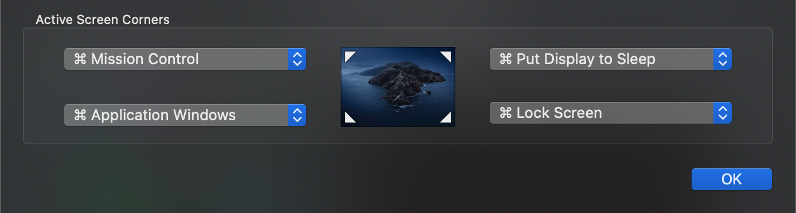

# New-MacBook-Todo-List
First things to do when start using a new Mac(Intel)

## 需要做的准备
- [ ] 	[保留屏幕垫纸](https://www.ifanr.com/574157)（[网页快照](https://web.archive.org/web/20180605044725/https://www.ifanr.com/574157)）
- [ ]	保留包装盒（及所有内含物品）
- [ ] 	准备好 Time Machine 硬盘
- [ ]	准备好 1Password 记录下每个密码（开机密码、登录密码、FileVault 密码、磁盘加密密码等）

## 设置
- [ ] 为自己的每个 Apple ID 创建用户
- [ ] 设置至少一个管理员账户
- [ ] Touch ID/Face ID（希望会有）
- [ ] 设置 Hot Corners...

- [ ] 更改屏幕快照存储路径（命令行 或 ⌘ + shift + 5）
- [ ] 添加音频输出 Utilities > Audio MIDI Setup.app
- [ ] 显示所有文件扩展名

## [Homebrew](https://brew.sh) & Pakages
- [ ] youtube-dl
- [ ] ffmpeg
- [ ] aria2
- [ ] casks

## Applications
- [ ]	1Password
- [ ]	[Amphetamine](https://apps.apple.com/us/app/amphetamine/id937984704?mt=12) 
- [ ]	[Bartender](https://www.macbartender.com/) 🔑
- [ ]	[Browserosaurus](https://browserosaurus.com/) / [Choosy](https://www.choosyosx.com)
- [ ]	Chrome
- [ ]	CotEditor
- [ ]	[DriveDX](https://binaryfruit.com/drivedx) 🔑
- [ ]	[Encrypto](https://apps.apple.com/cn/app/encrypto-secure-your-files/id935235287?l=en&mt=12) 
- [ ]	[FDM](https://www.freedownloadmanager.org/download-fdm-for-mac.htm)
- [ ]	[Google Earth Pro](https://www.google.com/earth/versions/#earth-pro)
- [ ]	[IINA](https://iina.io/)
- [ ]	[iMazing](https://imazing.com/) 🔑
- [ ]	[Intel Power Gadget (?)](https://software.intel.com/en-us/articles/intel-power-gadget)
- [ ]	[iPreview](https://findergg.com)
- [ ]	[iStat Menus](https://bjango.com/mac/istatmenus/) 🔑
- [ ]	[Keka](https://www.keka.io/)
- [ ]	[Lulu](https://www.objective-see.com/products/lulu.html)
- [ ]	[Maccy](https://maccy.app)
- [ ]	[MacZip](https://ezip.awehunt.com/?locale=zh-CN)（原 eZip）
- [ ]	[Magnet](https://apps.apple.com/us/app/magnet/id441258766?mt=12)
- [ ]	[NightOwl](https://nightowl.kramser.xyz/)
- [ ]	 Numbers
- [ ]	[OBS](https://obsproject.com/)
- [ ]	Office 🔑
- [ ]	 Pages
- [ ]	Parallels Desktop 🔑
- [ ]	Telegram
- [ ]	[TripMode](https://tripmode.ch)
- [ ]	[Turboboost Switcher Pro for Intel Mac](https://gumroad.com/l/YeBQUF) 🔑
- [ ]	[Vanilla](https://matthewpalmer.net/vanilla/)
- [ ]	VS Code
- [ ]	[shadowsocksX-NG-R8](https://github.com/qinyuhang/ShadowsocksX-NG-R/releases)
- [ ]	 Xcode

## 推荐阅读
* [macOS Security and Privacy Guide](https://github.com/drduh/macOS-Security-and-Privacy-Guide#verifying-installation-integrity)

